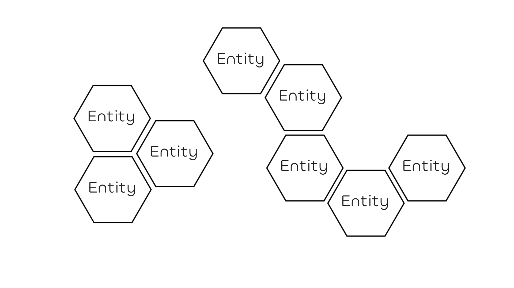

---
hide:
  - title
---

# Core Rules

To embrace the main objectives of this game, namely collaborative knowledge building and unexpected intellectual journeys, we have designed a series of game mechanics that will help the players emulate a fruitful and truly collaborative conversation.

## Knowledge Graphs

A knowledge graph is a non-hierarchical data structure composed by entities, namely any sort of thing you can imagine, and statements connecting them.

In _An Economy of Eloquence_, entities are represented by wooden hexagonal tiles that can store a small index card. During the game, tiles are connected with each other if the conversation creates a valuable statement between them. Interconnectivity between entities is a crucual facet of the game and players are encouraged to create as less connected components as possible by the end of the session.

## Resonance System

The **Resonance System** is a dice pool resolution mechanics designed by Nicholas Cornia, and has been used in experimental games such as [Sprezzatura RPG](https://nicholascornia89.github.io/sprezzatura_rpg/).

The players will use pools of ten-sides dice (d8s) and assemble pairs of results to generate a fractional number. The highest prime number of the fraction (after reducing numerator and denominator) is considered as result. With eight-sided dice there are only five possibilities, each of them reflecting a musical proportion, according to Medieval and Renaissance theory:

- **Unison (U)**: A fraction giving the unit 1, when both dice presents the same number, generates the unison proportion.
- **Octave (O)**: A fraction giving the ratio 2:1, such as 4/2,   generates an octave.
- **Fifth (F)**: A fraction with a ratio such that the highest prime number is 3, such as 4/3 or 6/4 = 3/2, generates the interval of the fifth or its complementary the fourth.
- **Third (T)**: A fraction with a ration such that the highest prime number is 5, such as 6/5 or 5/4, generates the interval of third, and its complementary the sixth.
- **Dissonance (D)**: In this system, ratios with a dominant prime number of 7 are associated with dissonant harsh sounds (at least for 16th centuries ears). 

Below a table describing all the possible combination of number given two d8s:

| d8 x d8 | 1 | 2 | 3 | 4 | 5 | 6 | 7 | 8 |
| :---: | :---: | :---: | :---: | :---: | :---: | :---: | :---: | :---: |
| 1 | **U** | **O** | **F** | **O** | **T** | **F** | **D** | **O** |
| 2 | | **U** | **F** | **O** | **T** | **F** | **D** | **O** |
| 3 | | | **U** | **F** | **T** | **O** | **D** | **F** | 
| 4 | | | | **U** | **T** | **F** | **D** | **O** | 
| 5 | | | | | **U** | **T** | **D** | **T** | 
| 6 | | | | | | **U** | **D** | **F** | 
| 7 | | | | | | | **U** | **D** | 
| 8 | | | | | | | | **U** | 

Given two dice the probability to obtain a given musical interval is not uniform: this asymmetry in the results' distribution means that the game favors some results than others. It is up to the players to bend this asymmetry in their favor thanks to the **Resonance Pool** mechanics.

Here you can find the probability distribution, given two dice of obtaining a certain proportion:

- P(U) = 1/8 ~ 12.5 %
- P(O) = 7/32 ~ 21.9 %
- P(F) = 1/4 ~ 25 %
- P(T) = 3/16 ~ 18.8 %
- P(D) = 7/32 ~ 21.9 %

### Resonance Pool

At the end of each turn, the active player can store an unused die, one that did not belong to the pair of dice that generated the action just taken, to a personal pool called the **Resonance Pool**. These dice can be used at any moment by the player to assemble musical intervals either during their own turn of any other player's. There is no limit of dice that can be kept, but an action like **Friction** can potentially reset a player's pool.

This mechanics has been designed to encourage collaboration and engagement of all players, reducing the burden of _downtime_[^1] by introducing agency of players in between turns.

## Eloquent Actions

To determine the available actions, a player rolls two eight-sided dice at the beginning of their turn. They can assemble a pair of dice to generate a musical interval, selecting dice from

- the two dice just rolled
- a die from their own _Resonance Pool_
- a die from another player's _Resonance Pool_

Below you can find the list of actions associated with each musical interval:

-   :material-pen: __Invent (Fifth)__

    ---
    The interval of a Fifth allows the active player to **Invent**. 

    You can introduce a new entity on the knowledge graph and describe it to the fellow players using a time slot.

    Afterwards, roll two d6s and advance your station accordingly 

    :material-plus-circle: :material-dice-6: :material-dice-6:

-   :octicons-book-16: __Digress (Third)__

    ---
    The interval of a Third allows the active player to **Digress**.

    You can use a time slot to deepen the conversation around an entity on the knowledge graph. After that they can establish a new connection with another concept on board by attaching the two hexagons if a spot is still available.

    Afterwards, roll one d6 and avance your station accordingly 

    :material-plus-circle: :material-dice-6:

-   :octicons-comment-discussion-16: __Quarrel (Unison)__

    ---
    The inverval of an Unison allows the active player to **Quarrel**.

    Choose two players (they can include youself) and an entity on the knowledge graph.

    The designated players receive two time slots to discuss about a topic associated with the entity. 

    After that the other players who did not participated in the content, vote the most convincing speaker who immediately can create a new connection between two existing entities or a brand new one on the board.

    Afterwards, each player that participated to the quarrel advances their pawn d6 steps. 

    :material-plus-circle: :material-dice-6: 

    If you did not participate to the quarrel, regress your pawn two steps :material-minus-circle:

-   :simple-discourse: __Summon (Octave)__

    ---
    The interval of an Octave allows the active player to **Summon**.

    Choose a fellow player and invite them to talk about an entity on board.

    After that, draw together a new connection on the board that has been the most representative from the discussion. 

    Afterwards, the fellow player advances their pawn one d6 

    :material-plus-circle: :material-dice-6: 

    and you regress 2 steps :material-minus-circle:

-   :material-lightning-bolt: __Friction (Dissonance)__ 

    ---
    
    A _Dissonace_ generates a **Friction**. Reset **all** **Resonance Pools** by removing all collected dice from each player.

    Afterwards regress your pawn by two d6s.

    :material-minus-circle: :material-dice-6: :material-dice-6:

## The Game of Goose

Inspired by the board game [_Patchwork_](https://boardgamegeek.com/boardgame/163412/patchwork), we decided to use a dynamic initiative system for our game as an alternative to the conventional clockwise or counter-clockwise turn order. Each player places a pawn on a Game of Goose board, both representing their score and initiative position. At the end of each player's turn, their pawn will advance according to the perfomed **Eloquent Action**.

| Action   | Meeple advance value |
| -------- | -------------- |
| **Invent** | +2d6  |
| **Digress** | +1d6 |
| **Quarrel** | +1d6 for each participant, -2 active player |
| **Summon** | +1d6 participant, -2 active player |
| **Friction** | -2d6, reset all **Resonace Pools** |

Usually, the player with pawn in the lowest station of the Game of Goose can take the next turn. In case of ties, the GM can choose which player goes first.

The GM has to decide beforehand which station will end the game. We advise the following values, but bear in mind that larger groups will take longer to reach the end station:

- 28 for a short session
- 42 for a comprehensive exploration
- 63 for a long session ranging multiple hours, for example a conference day.
    
## Eloquence Score

_An Economy of Eloquence_ is a cooperative game that takes inspiration to collaborative games such as [_Hanabi_](https://boardgamegeek.com/boardgame/98778/hanabi) and [_Tales of Kunugi_](https://boardgamegeek.com/boardgame/422620/tales-of-kunugi).

The main goal of the group is to achieve the lowest collective **Eloquence Score**, reflecting balance and collaboration between the players during the creation of the knowledge graph. For a detailed calcuation of the score, see the [End of the Game](playing_the_game.md) section.

When a player reaches the designated end-of-game station, the game session ends.  The GM and the players compute the final **Eloquence Score** based on the average distance between the players' final stations and the mean position on the **Game of Goose**. In order to win, the players must ensure a balanced distributions of stations at the end of the game, reflecting how much a player has participated to the discussion. Furthermore, connectivity between entities is encouraged via a **Connected Components Penalty** score, inviting players to link all concepts in a unique narrative.

[^1]: _downtime_: term used in board games to indicate the period of inactivity for a player outside of their turn.